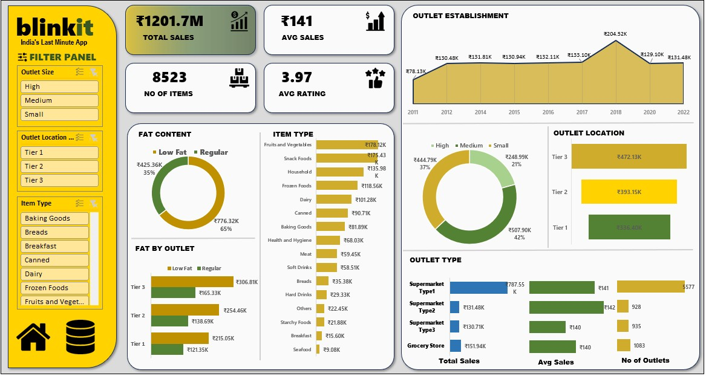

# Blinkit Sales Analysis - Excel Dashboard 📊

## **Project Overview**

This project involves an interactive sales dashboard created in Microsoft Excel to analyze the sales performance of Blinkit (India's Last Minute App). The dashboard provides insights into total sales, average sales, product categories, outlet performance, and more.

## Features

✅ **Dynamic Filters**: Users can filter data by **outlet size, location, and item type** to explore specific insights.  
✅ **Key Metrics**: Displays **total sales, average sales, number of items, and average rating**.  
✅ **Sales Breakdown**: Sales analysis based on **item type, fat content, and outlet location**.  
✅ **Outlet Performance**: Comparison of sales performance across different **outlet sizes and types**.  
✅ **Trend Analysis**: A line chart showcasing **outlet establishment trends** over time.

## Insights from the Analysis

📌 **High sales concentration**: Certain product categories like **Fruits & Vegetables and Snack Foods** contribute significantly to total sales.

📌 **Outlet size impact**: **Large outlets** (High) generate **the most revenue** compared to Medium and Small outlets.

📌 **Tier 3 cities outperform**: Tier 3 locations have **higher total sales** compared to Tier 1 and Tier 2.

📌 **Regular fat items dominate**: Sales of **regular fat content** items are **almost twice as much** as low-fat items.

**DashBoard Image**

